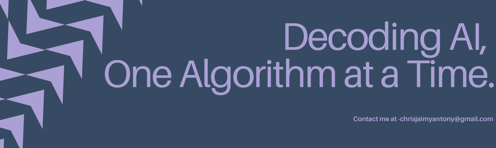

<h1 align="center">Hi, I'm Chris Jaimy Antony</h1>

<strong>Aspiring Research Scientist | AI & ML Enthusiast </strong>

---

## About Me

Welcome to my GitHub! I'm a curious and driven learner actively working at the intersection of artificial intelligence, creative problem-solving, and research. I'm especially passionate about making systems that think with you—not just for you.

---

## What I’m Working On

- Building an **LLM Fairness System** to make your LLMs, less racist.

---

## Currently Learning

- Advanced **Machine Learning** and **LLM Architectures**
- **Calculus fundamentals** for AI: implicit differentiation, partial derivatives, and PDEs
- **Linear Algebra** for understanding how Vector Spaces work.

---

## Communities & Contributions

- Research and Content Head at the **Centre for AI**, Christ University  
- Member of the **AI Guild** and **Eulim Science Club**  
- Tech & Outreach Contributor at the **Department of Social Action**

---

## Tech Stack

  
  
  
  
  
  

---

## GitHub Stats

  
  

---

## Let’s Connect

- [LinkedIn](https://www.linkedin.com/in/chris-jaimy-antony)
- Open to research collaborations, projects, and deep-dive discussions

---

> "Code is art. Research is discovery. And learning is a lifelong adventure."

Thanks for visiting — feel free to explore my work!
